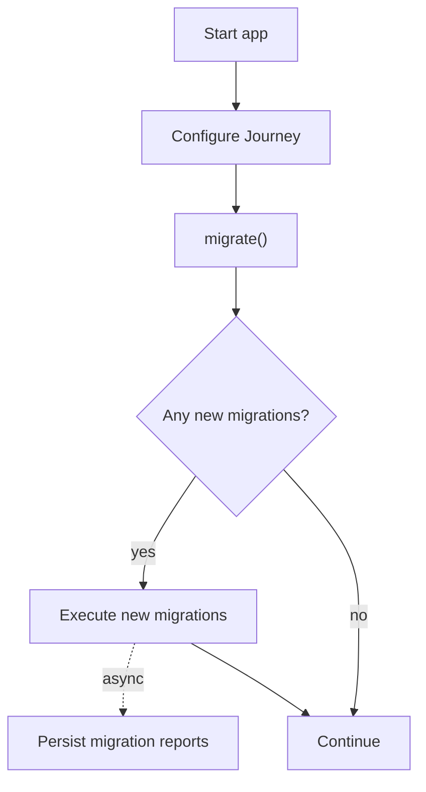

# Journey 

As soon as your app is published it goes on this wild journey and likely receives new interesting features to benefit
your users. Along the way there will be times when you need to run one-time migrations to prepare for these exciting
new features!

This package helps you run one-time migrations in your app incrementally, while trying to reduce impact on app start-up
time as much as possible.

If you need to run a one-time "something" (called a migration in this context) in your app, you can use this library for that.

Migrations can be executed in one batch, or in groups by creating multiple journeys.


## Features

* Run incremental migrations.
* Optionally implement a rollback mechanic for migrations.
* Reset `Journey` so all migrations will be executed again.

### How does Journey work?



## Getting started

To use Journey, you will need to include this package in your pubspec:

```yml
# pubspec.yaml
dependencies:
  journey:
```

## Usage

Create migration implementations for the all the migrations in your app:

```dart
class MigrateUserModelToHaveMultipleJourneys extends Migration {
  String get id => "migrate_user_model_to_have_multiple_journeys";

  @override
  Future<MigrationResult> migrate() async {
    // change the data model of your underlying data structure
    return MigrationResult.successful;
  }
}

class MigrateTokensToNativeSecureStorage extends Migration {
  String get id => "migrate_tokens_to_native_secure_storage";

  @override
  Future<MigrationResult> migrate() async {
    // read the tokens from the previous storage, and move them to the secure storage
    return MigrationResult.successful;
  }
}
```

Once you've defined your migrations, define the journey:

```dart
final journey = Journey(
  migrations: [
    MigrateUserModelToHaveMultipleJourneys(),
    MigrateTokensToNativeSecureStorage(),
  ],
);
```

After defining the journey, execute the migrations at an appropriate time in your app:
```dart
// U can use the reports for analytical purposes
final reports = await journey.migrate();
```

If at some point, or for testing, you want to execute migrations again, you can rollback migrations:

```dart
// rollback the migrations
await journey.rollback();

// reset all migration reports
await journey.reset();
```